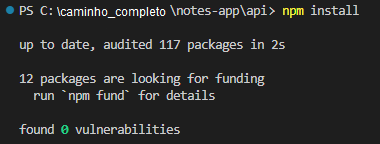
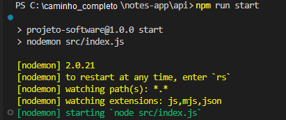
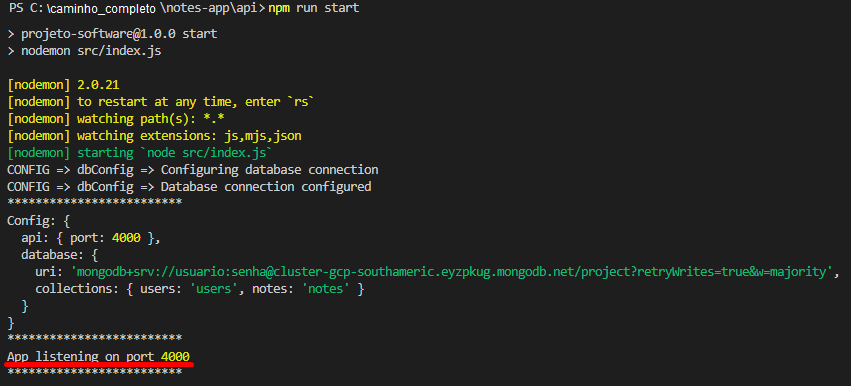

# Notes App

Esta é API do notes-app, um aplicativo de gestão de notas.

## Pré-requisitos

- Node v18.15
- NPM

> OBS: Para instalar o Node e o NPM, utilize seu método favorito. Nossa recomendação é seguir a documentação: [Downloading and installing Node.js and npm](https://docs.npmjs.com/downloading-and-installing-node-js-and-npm)

## Iniciando o projeto pela primeira vez

Na primeira vez que for iniciar o projeto é necessário instalar o pacotes npm.

Para fazer isso:

1. Abra um terminal, seja Linux, CMD, PowerShell;
2. Vá até a pasta "notes-app/api" (Exemplo: "C:\users\Andrey\notes-app\api")
3. Digite o comando: npm install

## Rodando o projeto

1. Abra um terminal, seja Linux, CMD, PowerShell;
2. Vá até a pasta "notes-app/api" (Exemplo: "C:\users\Andrey\notes-app\api")
3. Digite o comando: npm start

Aguarde até verificar a seguinte mensagem:

**Pronto! A API está rodando localmente.**
